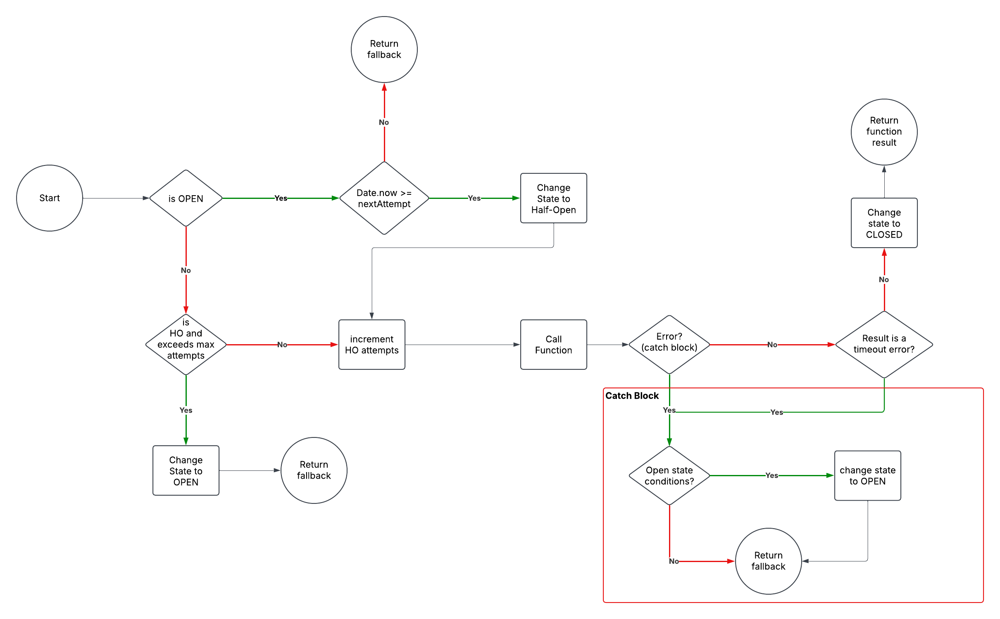

# Circuit Breaker JS

The Circuit Breaker pattern is used to prevent a system from making repeated failing calls to an unstable or slow service. It works like an electrical circuit breaker:

- When requests succeed, the circuit remains CLOSED (normal operation).
- If failures exceed a defined threshold, the circuit OPENS, blocking further requests for a cooldown period.
- After the cooldown, it enters a HALF-OPEN state, allowing limited test requests. If they succeed, the circuit CLOSES again; if they fail, it stays OPEN.

This helps improve system stability, reduce response time, and prevent cascading failures in distributed systems. 🚀

## Circuit Breaker Diagram



## Usage Example

```javascript
const testFn = (counter) => {
    if (counter > 3) throw Error('Unexpected Error');
    return 'SUCCESS';
}

const testCircuitBreaker = new CircuitBreaker(testFn, {
    percentThreshold: 30,
    timeout: 500,
    timeToRecover: 60000,
    maxHalfOpenAttempts: 1
});

const result = await testCircuitBreaker.execute('ERROR', 0); // In this case 'ERROR' is the fallback
```
